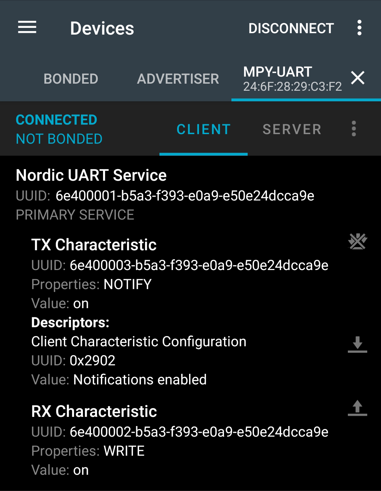

<h1 align="center">ESP32 BLE - UART</h1>

<p align="center"></p>

### 项目介绍

[MicroPython for ESP32 开发板低功耗蓝牙（BLE）研究学习项目](https://gitee.com/walkline/esp32-ble)的分支项目，使用`ESP32开发板`通过`UART`与其它设备交换数据

### 如何使用呢？

* 下载并烧录自定义的固件到开发板
* 如果你用的是官方最新固件的话可以参考`不想烧录自定义固件？`部分
* 把项目目录下的`main.py`和`ble`文件夹上传到开发板，并运行`main.py`文件
* 使用安卓手机下载安装 [nRF Connect](https://github.com/NordicSemiconductor/Android-nRF-Connect/releases)
* 在`nRF Connect`中搜索并连接默认名称为`mpy-uart`的设备

	

* 然后按如下顺序操作：
	1. 按一下开发板上的`BOOT`按键，板载 Led 点亮的同时手机上的`TX Characteristic`会收到数据`on`，再次按下按键收到`off`
	2. 手机上点`RX Characteristic`右侧的上箭头，在弹出的数据发送窗口中发送`on`，可以点亮开发板的板载 Led

		

`REPL`中的完整输出内容如下：
```docs
activating ble...
I (12270) BTDM_INIT: BT controller compile version [5aed448]
I (24880) system_api: Base MAC address is not set, read default base MAC address from BLK0 of EFUSE
I (24990) phy: phy_version: 4102, 2fa7a43, Jul 15 2019, 13:06:06, 0, 0
GAP procedure initiated: stop advertising.
ble activated
GAP procedure initiated: advertise; disc_mode=2 adv_channel_map=7 own_addr_type=0 adv_filter_policy=0 adv_itvl_min=800 adv_itvl_max=800
advertising...
>>> [79:75:C6:5B:08:1F] connected, handle: 0
GATT procedure initiated: notify; att_handle=3
GATT procedure initiated: notify; att_handle=3
rx received: b'on'
GATT procedure initiated: notify; att_handle=3
[79:75:C6:5B:08:1F] disconnected, handle: 0
GAP procedure initiated: advertise; disc_mode=2 adv_channel_map=7 own_addr_type=0 adv_filter_policy=0 adv_itvl_min=800 adv_itvl_max=800
advertising...
```

### 下载烧录自定义固件

访问 [自定义固件下载项目](https://gitee.com/walkline/esp32_firmware) 下载最新的自定义固件，并参考 [附录1：如何刷写固件](https://gitee.com/walkline/esp32_firmware#%E9%99%84%E5%BD%951%E5%A6%82%E4%BD%95%E5%88%B7%E5%86%99%E5%9B%BA%E4%BB%B6) 烧录固件到开发板

### 不想烧录自定义固件？

当然没问题，不过要确认你现在的固件是**支持`ble`的**，然后

* 下载 [const.py](https://gitee.com/walkline/micropython-beacon-library/raw/master/ble/const.py)

* 下载 [tools.py](https://gitee.com/walkline/micropython-beacon-library/raw/master/ble/tools.py)

保存到项目目录`ble`文件夹下，一起上传到开发板即可

### 合作交流

* 联系邮箱：<walkline@163.com>
* QQ 交流群：
    * 走线物联：163271910
    * 扇贝物联：31324057

<p align="center"></p>
